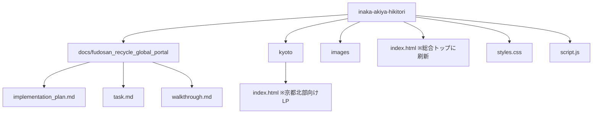

# 負動産リサイクルセンター 総合トップページ開設および京都LP移行の実装計画

本計画は、サービス名（ドメイン名）「負動産リサイクルセンター（fudosan-recycle.com）」の立ち上げに伴い、総合トップページをルート配下に構築し、既存の京都北部向けLPを `/kyoto/` サブディレクトリへ移行する手順をまとめたものです。

## ユーザー確認事項

> [!NOTE]
> * 京都エリアページの移行にあたり、アセット（画像・CSS・JS）は親ディレクトリのものを共通で参照する形（`../` を経由）に調整し、コードの重複を防ぎます。
> * 送信フォーム処理（`script.js`）は、総合トップと京都ページの双方で共通の動作になるため、同一のJSファイルを参照します。

## 開放された質問 (Open Questions)
* 特になし（事前承認済みのため、本計画に沿って実装を開始します）。

## 提案される変更点

### 1. ディレクトリ構造の変更

---

### 2. コンポーネント別の詳細変更

#### [NEW] [implementation_plan.md](file:///c:/Users/tatsu/OneDrive/デスクトップ/物件配信/inaka-akiya-hikitori/docs/fudosan_recycle_global_portal/implementation_plan.md)
* 本実装計画ドキュメント。

#### [NEW] [task.md](file:///c:/Users/tatsu/OneDrive/デスクトップ/物件配信/inaka-akiya-hikitori/docs/fudosan_recycle_global_portal/task.md)
* 進捗管理用のタスクリスト。

#### [NEW] [kyoto/index.html](file:///c:/Users/tatsu/OneDrive/デスクトップ/物件配信/inaka-akiya-hikitori/kyoto/index.html)
* 現行の `index.html` をコピーして作成。
* パス書き換え:
  * `styles.css` -> `../styles.css`
  * `script.js` -> `../script.js`
  * `images/hero.png` -> `../images/hero.png`
* SEO/OGP/構造化データ情報のドメイン名を `fudosan-recycle.com/kyoto/` に更新。
* サイトヘッダー・フッターに「負動産リサイクルセンター 京都北部窓口」の文言を適用。

#### [MODIFY] [index.html](file:///c:/Users/tatsu/OneDrive/デスクトップ/物件配信/inaka-akiya-hikitori/index.html)
* 既存の京都向けLPから、総合トップページ（構成案）へと全面刷新。
* 構成案に基づく各セクション（ヒーロー、お悩み、提供価値、有料引き取りの理由、リサイクルスキーム、サポート体制・エリアリンク、手続きの流れ、無料査定フォーム、フッター）を実装。
* エリアリンク部分に「京都北部エリア窓口」へのリンク（`/kyoto/`）を設置。「和歌山エリア」「大阪エリア」などは準備中として併記。

#### [MODIFY] [styles.css](file:///c:/Users/tatsu/OneDrive/デスクトップ/物件配信/inaka-akiya-hikitori/styles.css)
* 総合トップ特有のセクションデザイン（エリア選択リンクや、リサイクルスキーム図などの視覚要素）を追加。
* 既存のフォレストグリーン（`#1b4332`）やアースベージュ（`#f4f1ea`）を基調とした美しいトーン＆マナーを崩さず、より洗練されたプレミアムなUIに仕上げます。

---

## 検証計画

### 手動検証
1. **パス・リンクの確認**: 
   * ローカルサーバーで総合トップ（`/`）を開き、各エリア（`/kyoto/`）へのリンクが正しく遷移することを確認。
   * `/kyoto/` ページでCSS・JS・背景画像が欠けなく読み込まれていることを確認。
2. **デザインの美しさとレスポンシブ対応**:
   * 総合トップページがPC・モバイル双方でプレミアムな外観を維持しているか確認。
   * アコーディオンや送信完了モーダルが動作することを確認。
3. **フォーム送信機能の動作検証**:
   * 総合トップページのお問い合わせフォームを入力し、ダミー送信処理（モーダル表示、ローディング）が正しく行われるか確認。
